# PlantUML Diagrams for Signage OS Technical Documentation

Copy each diagram into https://www.plantuml.com/plantuml/uml/ to render.

---

## Figure 2.1 — End-to-End System Workflow

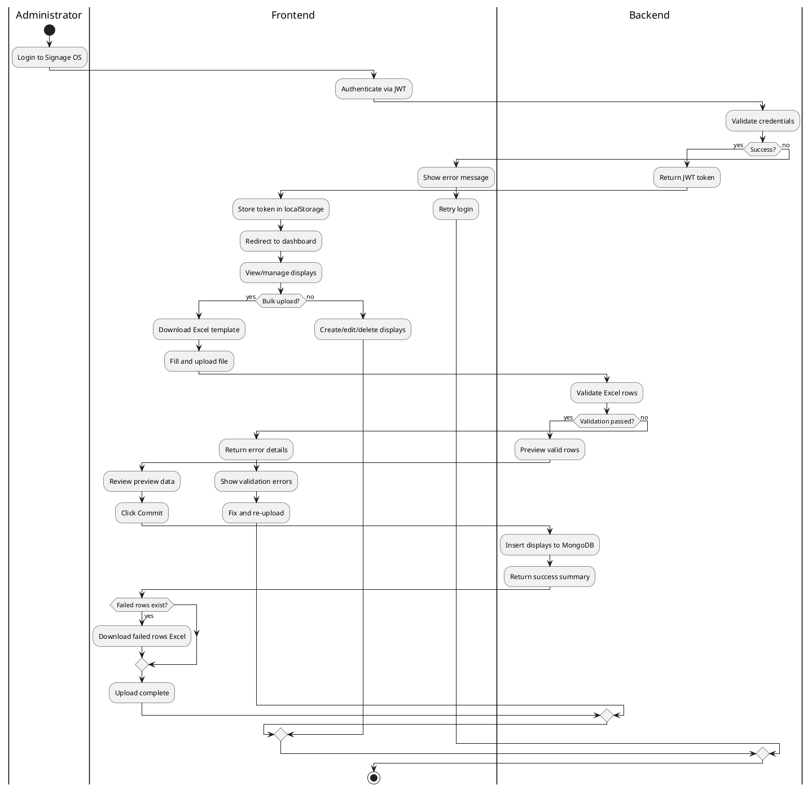

---

## Figure 3.1 — High-Level Architecture

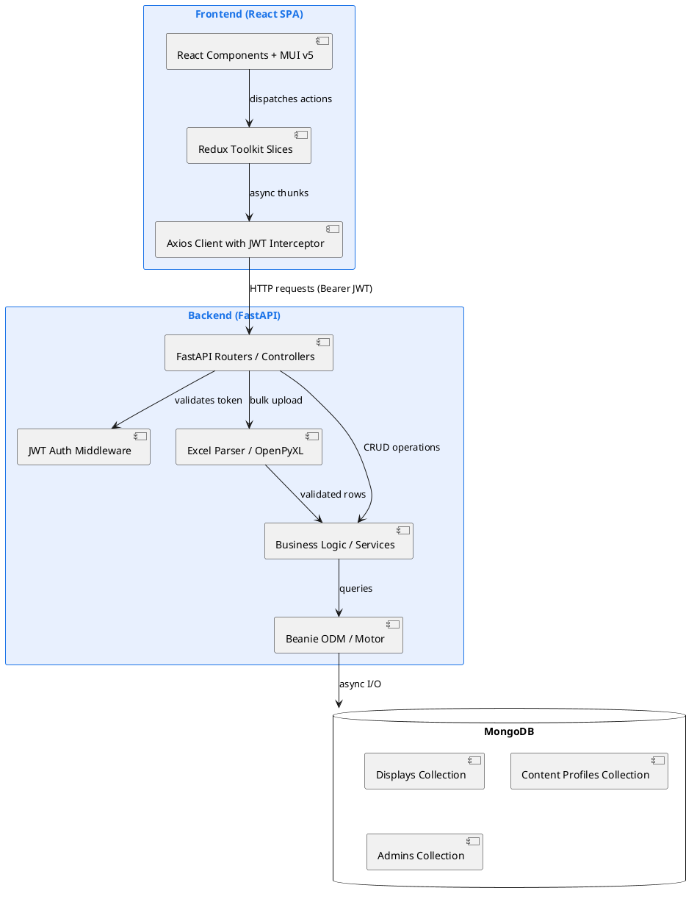

---

## Figure 3.2 — Low-Level Design: Repository Structure

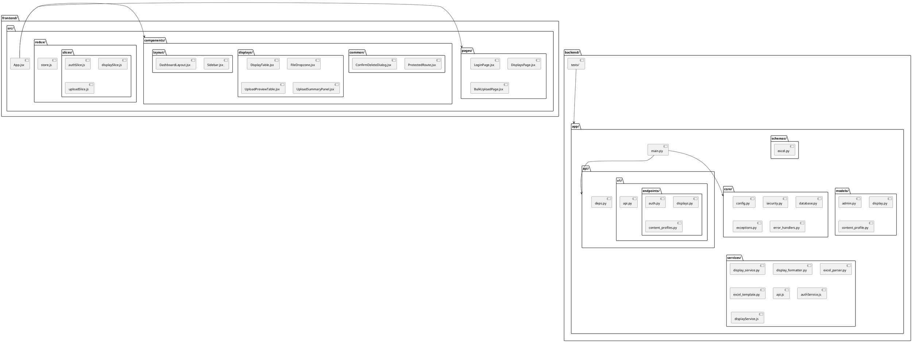

---

## Figure 3.3 — Component Architecture

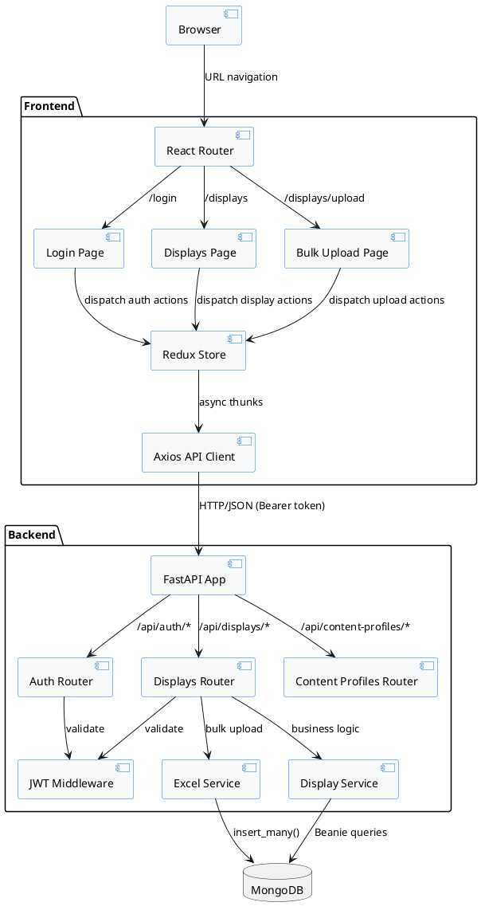

---

## Figure 3.5 — Data Flow Diagram

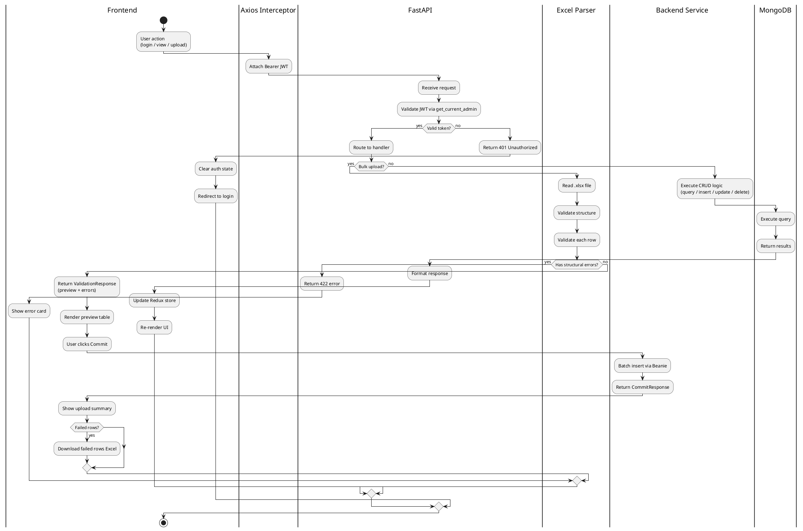

---

## Figure 3.6 — Sequence Diagram: Login to Display Management

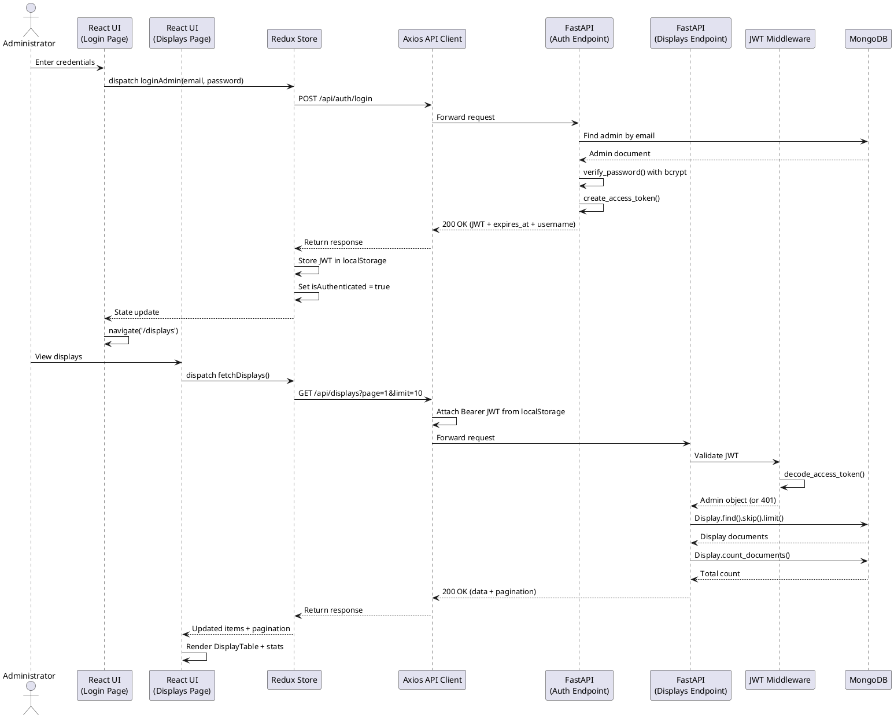

---

## Figure 6.1 — Database Relationship Diagram

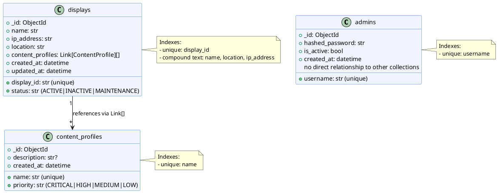

---

## Figure 8.1 — Web Interface: Main Views

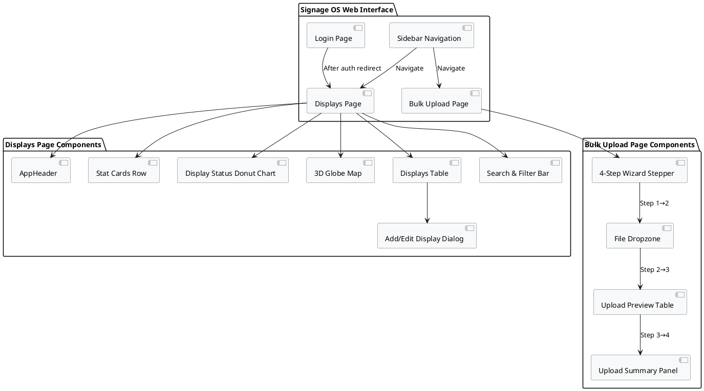

---

## Figure 8.2 — Dashboard Workflow

```plantuml
@startuml
|User|
start
:Navigate to /displays;
|Frontend|
:Load DisplaysPage;
:Render stat cards
(total, active, maintenance, inactive);
:Render donut chart
(status distribution);
:Render 3D globe
(geographic visualization);
:Render displays table
(all displays with pagination);
|User|
if (Action?) then (Search/Filter)
  |Frontend|
  :Type in search bar;
  :Select status filter;
  :Dispatch fetchDisplays with params;
  |Backend|
  :Query with text search + filter;
  :Return paginated results;
  |Frontend|
  :Update table rows;
else (Add Display)
  |Frontend|
  :Open DisplayFormDialog;
  :Fill form fields;
  :Submit;
  |Backend|
  :Validate and create display;
  :Return created object;
  |Frontend|
  :Refresh display list;
  :Show success notification;
else (Edit Display)
  |Frontend|
  :Open DisplayFormDialog with data;
  :Modify fields;
  :Submit;
  |Backend|
  :Update display document;
  :Return updated object;
  |Frontend|
  :Refresh display list;
else (Delete Display)
  |Frontend|
  :Open ConfirmDeleteDialog;
  :Confirm deletion;
  |Backend|
  :Delete display document;
  |Frontend|
  :Refresh display list;
  :Show success notification;
else (Bulk Upload)
  :Navigate to /displays/upload;
  :Follow upload wizard;
endif
|User|
stop
@enduml
```

---

## Figure 9.5 — Deployment/Execution Model

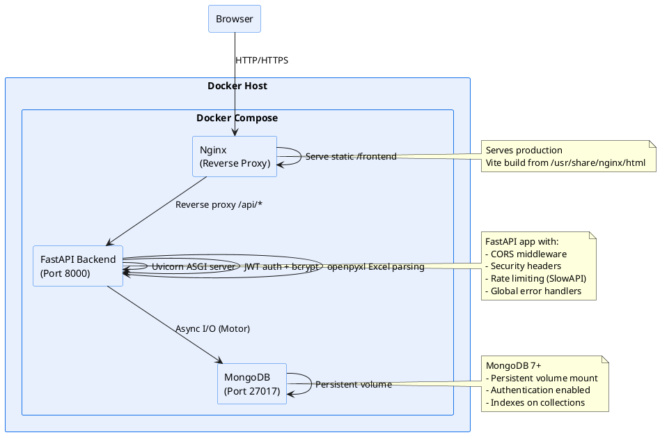

---

## Figure 10.2 — Test Case Matrix

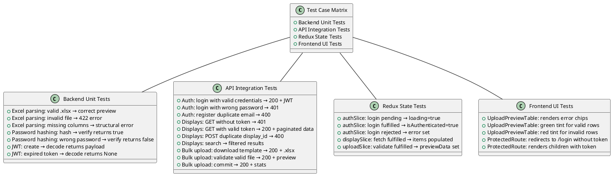

---

## Figure 10.5 — Test Run / Smoke-Test Report

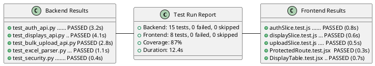

---

## Figure 11.1 — Docker Deployment Architecture

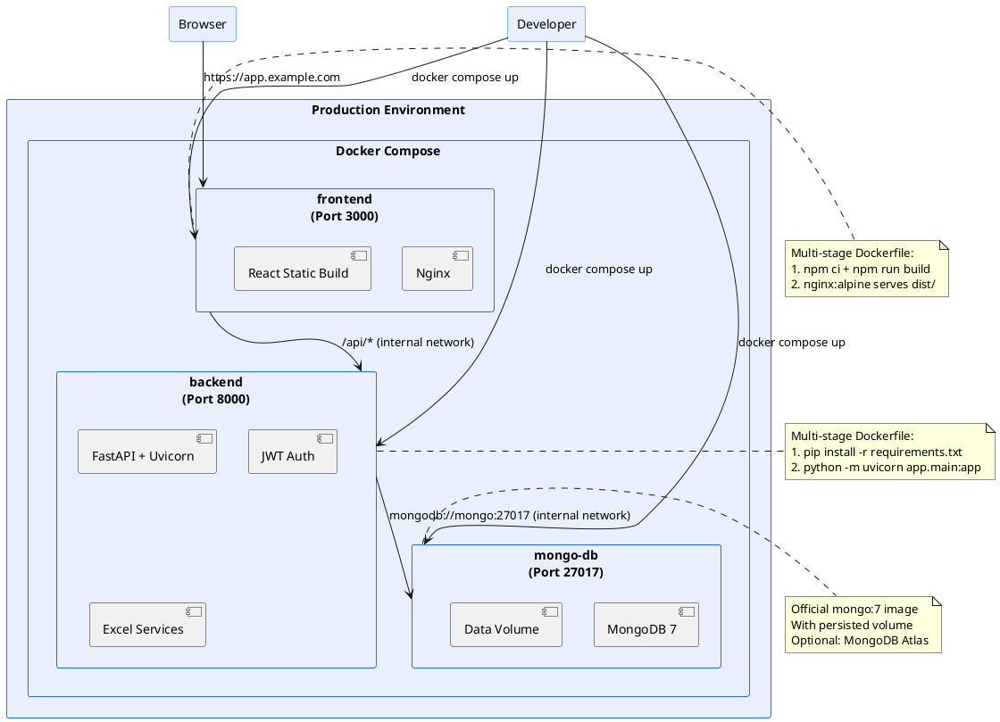

---

## Figure 11.2 — CI/CD Pipeline

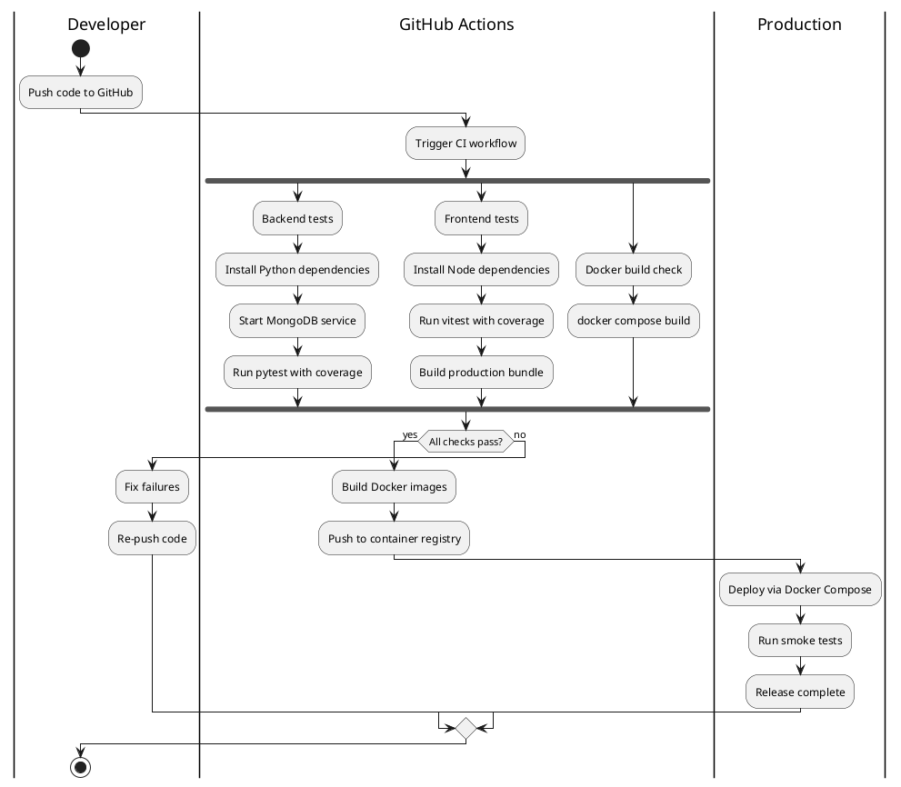
